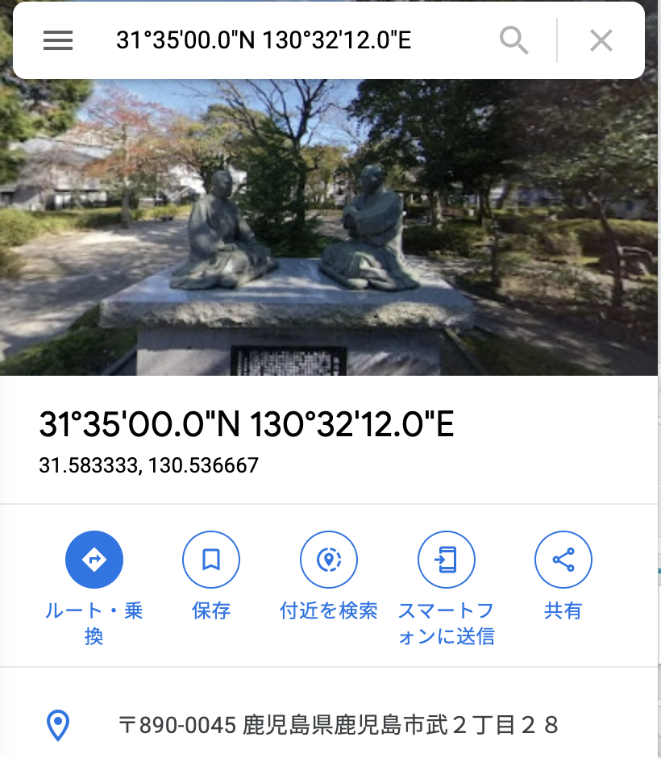

# [Forensics] River 10pts
JPEGという画像ファイルのフォーマットでは、撮影時の日時、使われたカメラ、位置情報など様々な情報(Exif情報)が付加されることがあるらしい。\
この情報から、写真に写っている川の名前を特定して欲しい。\
問題ファイル： river.jpg

FLAGの形式は、"cpaw{river_name}"\
例：隅田川 → cpaw{sumidagawa}
# Solution
JPEGでは、撮影時の日時、使われたカメラ、位置情報などさまざまな情報(Exif情報)が付与されることがあるらしい。今回はそれを取得する問題。ググった結果、jheadコマンドで取得できるらしい。早速実行。

```bash
$ jhead river.jpg
File size    : 424184 bytes
File date    : 2022:03:17 10:25:08
Camera make  : Sony
Camera model : SO-01G
Date/Time    : 2015:09:14 12:50:38
Resolution   : 3840 x 2160
Flash used   : No
Focal length :  4.6mm
Exposure time: 0.0005 s  (1/2000)
Aperture     : f/2.0
ISO equiv.   : 50
Whitebalance : Auto
Metering Mode: pattern
GPS Latitude : N 31d 35m  2.76s
GPS Longitude: E 130d 32m 51.727s
JPEG Quality : 23
======= IPTC data: =======
City          : 
Record vers.  : 2
DateCreated   : 20150914
Time Created  : 125038
```

GPS ~ に緯度経度が書いてあるので、この値をGoogle Map で検索して、近くの川の名前を取得。
