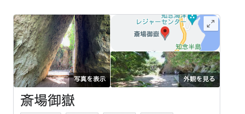

# [OSINT] Desk 454pts 69Solves
つくし君の大好きなお姉さんのデスクを見学させてもらったよ。 さて、このデスクはどこにあるのだろうか?
フラグ形式は写真が撮影された場所の郵便番号(ハイフンを除く)を入れて下さい。例えば撮影された場所が東京都庁の場合、郵便番号は163-8001なので TsukuCTF22{1638001} となります。

# Solution
机の上に置いてあるパンフレットから沖縄県であると推測。さらに右下に「世界文化遺産」の文字があり、その左側に岩っぽい場所を背景にしてに見知らぬゆるキャラがいる。Googleで「沖縄 世界文化遺産」で検索。すると、岩の絵に似た場所がヒット。

この地域の郵便番号である 9011511 がフラグとわかった。