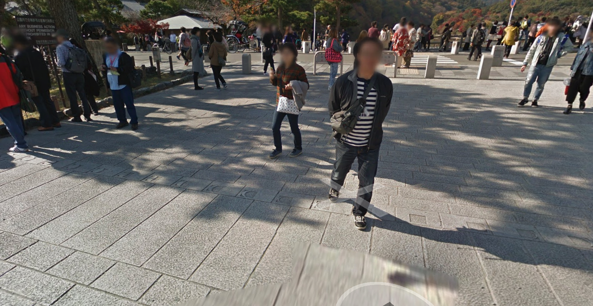

# [OSINT] moon 499pts 14Solves
月の満ち欠けは美しい。この場所はどこだろうか。 ※フラグの形式はTsukuCTF22{緯度_経度}です。ただし、緯度経度は十進法で小数点以下五桁目を切り捨てたものとします。

# Solution
はじめ、「これでわかるの？？？」ってなった問題。Googleで「月の満ち欠け 石 道」みたいなノリで検索したけど、全然ヒットせず。一旦頭を休ませる。月の満ち欠けが地面に彫られてるもオシャレだな〜〜〜って感性 -> これ見た人SNSにアップするのでは？ ってなった。てことで、Twitter で検索開始。「月の満ち欠け 石」で調べると、いい感じの[ツイート](https://twitter.com/tmct69/status/726579357251043328?s=12&t=4GsFB8y2PX_0NkICsobgGw)を発見。中之島から渡月橋ヘ行く手前の石畳にあるみたい。Googleストリートビューでその付近を探索すると、問題の場所を発見でき,その場所の緯度経度経度は 35.0120, 135.6778 (小数点以下5桁目を切り捨て)

他の参加者のWriteupを読んで分かったが、実は[2枚目](moon2.jpg)の右上に「京都」と書かれているのがわかり、それを手がかりに見つけられるみたい。