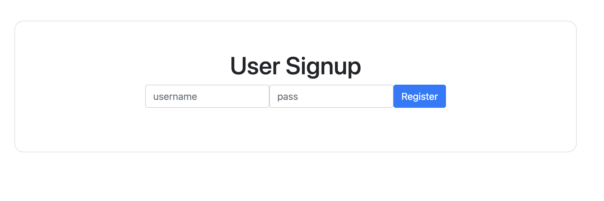
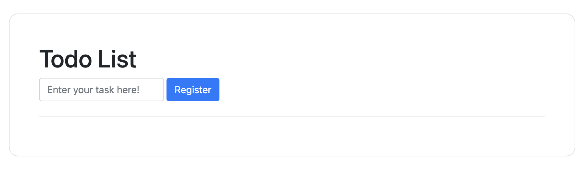

# [WEB] serial 109pts
フラッグは flags テーブルの中にあるよ。ゲットできるかな？

https://serial.quals.beginners.seccon.jp

# Solution

適当な値を入力してRegisterボタンを押すとTodo Listが表示された。

問題文にフラグはflagsテーブルにあると書いてあるので、SQLインジェクションを狙う。
試しに `' OR 1=1 --` を送信すると、`? OR 1=1 --` が返ってきた。`'` がエスケープ処理されている。ソースコードを読んで確認する。
### todo.php
```PHP
<?php

class Todo {
    private const invalid_keywords = array("UNION", "'", "FROM", "SELECT", "flag");

    public $id;
    public $body;
    public $done;

    public function __construct($id = null, $body = null, $done = null) {
        $this->id = htmlspecialchars($id);
        $this->body = htmlspecialchars(str_replace(self::invalid_keywords, "?", $body));
        $this->done = $done;
    }
}

```
SQLインジェクションで頻繁に使われる単語や記号はエスケープ処理されていることがわかる。なので、TodoListからの攻撃は一旦諦める。ソースコードを読み進めていくと、`database.php` にヒントらしきものを見つけた。
### database.php
```PHP
    /**
     * findUserByName finds a user from database by given userId.
     *
     * @deprecated this function might be vulnerable to SQL injection. DO NOT USE THIS FUNCTION.
     */
    public function findUserByName($user = null)
    {
        if (!isset($user->name)) {
            throw new Exception('invalid user name: ' . $user->user);
        }

        $sql = "SELECT id, name, password_hash FROM users WHERE name = '" . $user->name . "' LIMIT 1";
        $result = $this->_con->query($sql);
        if (!$result) {
            throw new Exception('failed query for findUserByNameOld ' . $sql);
        }

        while ($row = $result->fetch_assoc()) {
            $user = new User($row['id'], $row['name'], $row['password_hash']);
        }
        return $user;
    }
```
コメントからも分かるように、`$user->name` の値を操作することで、攻撃が可能。findUserByName関数を使っている箇所を探すと、`signup.php` と `user.php`の２つがあった。
### signup.php
```PHP
~~~

$name = $_POST['name'];
$pass = password_hash($_POST['pass'], PASSWORD_DEFAULT);
$user = new User(-1, $name, $pass);

try {
    $db = new Database();
    $db->insertUser($user);

    $user = $db->findUserByName($user);
    if (!$user->isValid()) {
        throw new Exception("invalid user: " . $user->__toString());
    }
} catch (Exception $e) {
    var_dump($e->getMessage());
}

setcookie("__CRED", base64_encode(serialize($user)));

header('Location: /');
```
### user.php
```PHP
<?php

class User
{
    private const invalid_keywords = array("UNION", "'", "FROM", "SELECT", "flag");

    public $id;
    public $name;
    public $password_hash;

    public function __construct($id = null, $name = null, $password_hash = null)
    {
        $this->id = htmlspecialchars($id);
        $this->name = htmlspecialchars(str_replace(self::invalid_keywords, "?", $name));
        $this->password_hash = $password_hash;
    }

    public function __toString()
    {
        return "id: " . $this->id . ", name: " . $this->name . ", pass: " . $this->password_hash;
    }

    public function isValid()
    {
        return isset($this->id) && isset($this->name) && isset($this->password_hash);
    }
}

function login()
{
    if (empty($_COOKIE["__CRED"])) {
        return false;
    }

    $user = unserialize(base64_decode($_COOKIE['__CRED']));

    // check if the given user exists
    try {
        $db = new Database();
        $storedUser = $db->findUserByName($user);
    } catch (Exception $e) {
        die($e->getMessage());
    }
    // var_dump($user);
    // var_dump($storedUser);
    if ($user->password_hash === $storedUser->password_hash) {
        // update stored user with latest information
        // die($storedUser);
        setcookie("__CRED", base64_encode(serialize($storedUser)));
        return true;
    }
    return false;
}

function logout()
{
    setcookie("__CRED", "", time() - 30);
}

```
`signup.php` から確認する。\
引数の`＄user` は `＄user = new User(-1, $name, $pass)` からきているので、ここでインジェクション攻撃を起こすことは無理そう。（ _constructでエスケープ処理を行なっているため. ）\
`user.php` を確認する。\
引数の`$user` は `$user = unserialize(base64_decode($_COOKIE['__CRED']));` からきている。Cookieにセットした値をbase64でデコードして、それをデシリアライゼーションしている。`php unserialize` で調べると、脆弱性についての記事が見られたので、Cookieの値を変更することで攻撃が狙えそうである。攻撃の結果は`＄storeUser`に格納され、条件分岐`$user->password_hash === $storedUser->password_hash` を突破したら、Cookieにセットされる。`1_schema.sql` に flagsテーブルの構造が書いてあるので、あとは適切な攻撃文を選択すればフラグが手に入る。\
`'UNION SELECT NULL, body, CONCAT('', {password_hashの値}) FROM flags; -- ` をセットして送信すると、レスポンスのCookieの値が変更されていて、これを元に戻す（base64でデコード＆デシリアライゼーション）と、フラグが含まれていた。

書くことが多いと、まとめ方がわからない...分かりづらくてごめんなさい（ ;  ; ）