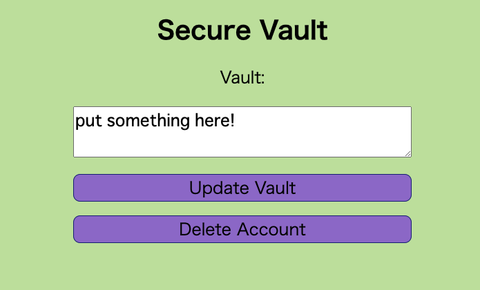

# [WEB] Secure Vault 130pts
Clam saw all those cool celebrities posting everything they do on twitter, so he decided to give it a go himself. Turns out, that's a horrible idea. After recovering from his emotional trauma, he wrote a [secure vault](https://secure-vault.web.actf.co/) to store his deepest secrets. Legend has it that there's even a flag in there. Can you get it?

[Source](https://files.actf.co/fe13ba90238aaf68aaa1083d55d3d88898cdc1a6cd30b1863822f04f38b5432a/index.js)

# Solution
指定されたページにアクセスすると、UsernameとPassword入力欄とLogin・Registerボタンがあるサイトが現れる。適当にサインアップすると、`put something here!` と書かれた画面に飛んだ。\


この画面ではVaultの値を変更できるのと、アカウントの削除が行えるらしい。

Vault画面に関するコードを読むと、

```jsx
~~~

app.get("/vault", (req, res) => {
    if (!res.locals.user) {
        res.status(401).send("Log in first");
        return;
    }
    const user = users.get(res.locals.user.uid);
    res.type("text/plain").send(user.restricted ? user.vault : flag);
});

~~~
```

`user.restricted != true` でフラグが表示されることがわかった。

ユーザーアカウント作成時にデフォルトで user.restricted に true がセットされているので、ユーザーアカウントを保持した状態では見られない。ユーザー情報なしで、res.locals.user を有効化する方法を模索すると、

```jsx
~~~

app.use((req, res, next) => {
    try {
        res.locals.user = jwt.verify(req.cookies.token, jwtKey, {
            algorithms: ["HS256"],
        });
    } catch (err) {
        if (req.cookies.token) {
            res.clearCookie("token");
        }
    }
    next();
});

~~~
```

res.locals.user は cookie から作られているので、cookieをセットすることで対応できることがわかる。Cookieコピー → アカウント削除 → Cookieペースト → `/vault` にアクセスでフラグが得られた。

ソースコード内でJWT扱ってるから、作問者の意図に沿ってない解法かも…JWTについて勉強して、別の解法が分かり次第追加予定。